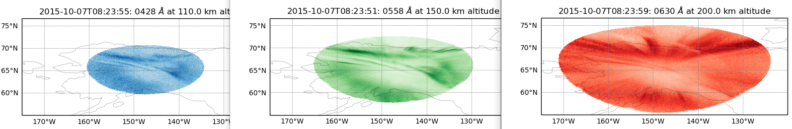

# DASC all-sky camera utilities

[](https://zenodo.org/badge/latestdoi/51016067)


[](https://pypi.python.org/pypi/dascutils)
[](http://pepy.tech/project/dascutils)

Utilities for plotting, saving, analyzing the Poker Flat Research Range Digital All Sky Camera. (Other locations, too).
This program handles the corrupted FITS files due to the RAID array failure on 2013 data.
The raw data FITS contain one image per file.


(using scripts/PlotProjectedImage.py
)

(using scripts/PlotAzimuthElevation.py)


## Install

Most people will find it useful to have the example scripts and the tests built into the Git repo.

```sh
git clone https://github.com/space-physics/dascasi

pip install -e dascutils
```

## Usage

To use the API directly, like:

```python
import dascutils as du

data = du.load('tests/PKR_DASC_0558_20151007_082351.743.FITS')
```

This returns a dictionary of
[xarray.DataArray](http://xarray.pydata.org/en/stable/generated/xarray.DataArray.html),
which is like a "smart" Numpy array.
The images are indexed by wavelength if it was specified in the data file, or '0000' otherwise.
The images are in a 3-D stack: (time, x, y).
`data.time` is the time of each image.
also several metadata parameters are included like the location of the camera.

Save the data using lossless compression to HDF5 by

```python
du.save_hdf5(data, "foo.h5")
```

Now we give several examples.

### Download raw DASC files by time

Download Poker Flat Research Range "PKR" October 7, 2015 from 8:23 to 8:54 UTC to `~/data/`:

```sh
dascasi_download PKR 2015-10-07T08:23 2015-10-07T08:54 ~/data
```

* `-w` four-letter wavelength in nanometers e.g. 0630

As usual, we assume UTC and do NOT specify the timezone.

### convert FITS stack to HDF5

It is very tedious to download large amounts of DASC data in single FITS files.
We have tried to make this faster by multi-threading the download, but then the FTP server anti-leeching
leaves us with broken downloads.
As an alternative in general, it's more convenient to have a single HDF5 file for a day rather than 10,000 FITS files.
Convert a bunch of FITS files to HDF5 like:

```sh
python scripts/ConvertDASC_FITS_to_HDF5.py ~/data/2015-10-07 ~/data/2015-10-07.h5
```

* `-t` start stop times to convert

### Make movies from DASC raw data files

Play movie of all wavelengths in subplots for files in a directory, for example:

```sh
dascasi_movie dascutils/tests/
```

additional options include:

* `-t` specify time limits e.g.  `-t 2014-01-02T02:30 2014-01-02T02:35`
* `-w` choose only certain wavelength(s)

### Spatial registration (plate scale)

To match data from DASC with other instruments, it is vital that the plate scale data user be appropriate for the time and instrument.
Calibration data may be [downloaded](ftp://optics.gi.alaska.edu/Cal_data/), for other times / instruments please contact UAF-GI.

```python
import dascutils as du

data = du.load('dascutils/tests/', azelfn='/path/to/your_calibration_file')
```

now `data` includes data variables `az` and `el`, same shape as the image(s), along with camera position in `lat` `lon` `alt_m`.

* Be sure you know if you're using magnetic north or geographic north
* Note the calibration date in the filename--was the camera was moved since that date?

In all cases, the end user must manually verify the calibration with sky features such as stars / moon.

### Map Projection

A common task in auroral and airglow analysis is to project the image to an imaginary alttiude, that is, as if all the brightness were coming from that altitude.
Each wavelength has a distinctive peak emission altitude due to the energies, kinetic reactions and vertical density profiles involved.

It takes considerable time to stretch the image stack pixels to fit a project geographic grid, so this is not enabled by default.
It will be enabled if the du.load(..., wavelength_altitude_km=) parameter is used.
See PlotProjectedImage.py for an example.

Some analyses can be done far more rapidly by just projecting pixel(s) of interest rather than an entire 3-D image stack.
